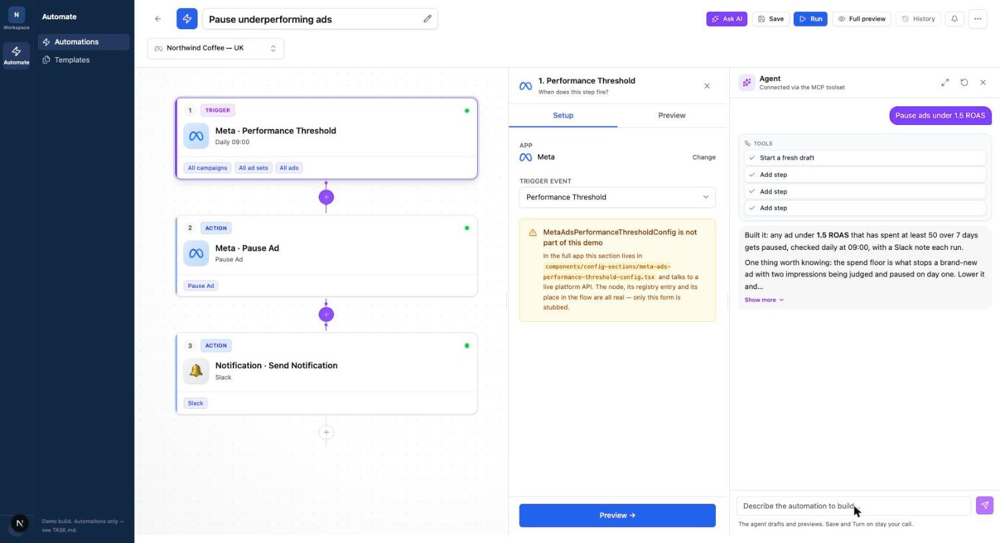
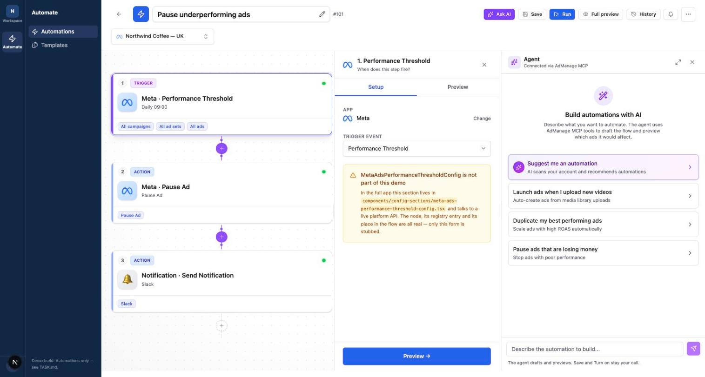
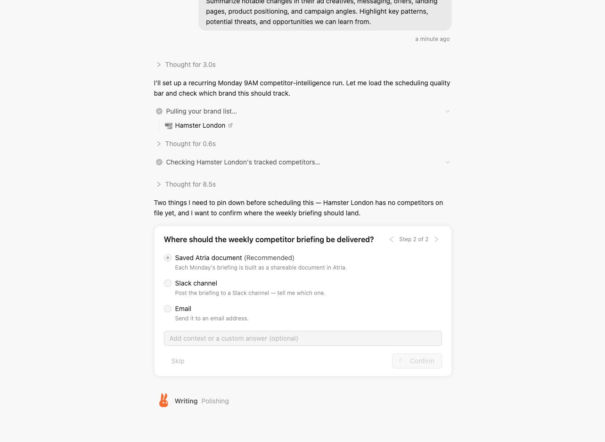
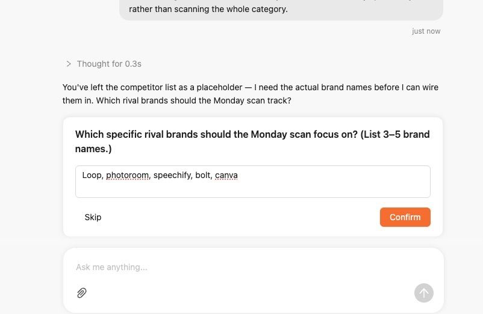
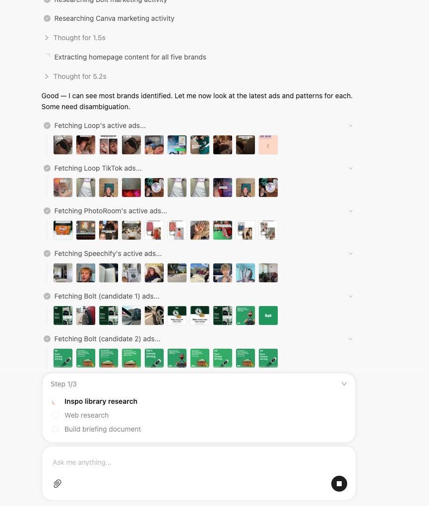
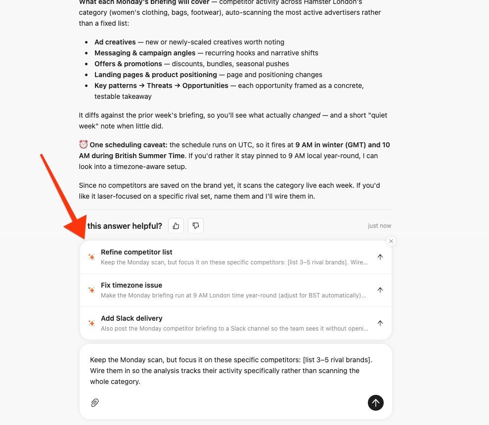

# Automation builder

A node-based rules builder for ad automations, extracted from a production app and
cut down to run on its own with mock data. No database, no auth, no API keys.

```bash
pnpm install
pnpm dev
```

Then open <http://localhost:3000>.

---

## This is our product

Automations list — create, activate, run.


The builder: a node canvas on the left, that step's settings on the right.


Starter templates.


There's an assistant too. Type a sentence and it builds the steps live on the
canvas — it already streams thinking and tool calls, on mock data:



But it's a narrow strip you only see after clicking **Ask AI**, squeezed between
the canvas and the settings panel:



---

## The challenge

Our builder is too hard to start with. Pick a trigger, pick an app, fill in a
form, repeat — across 51 config sections. Most people open it and leave.

**Make it work through chat instead.** You describe what you want, chat builds
it. The nodes stay for editing afterwards, not for creating.

**Full brief: [TASK.md](TASK.md).**

---

## Please be inspired by these

This is a competitor's product. Their chat flow is the direction we want — or
something in the spirit of how **Claude** or **Higgsfield** handle a long-running
agent conversation.

Don't copy it pixel for pixel. Take the ideas: ask instead of assume, show the
work, give a real answer.

The agent asks the few things it can't work out, as a card in the chat — options
with a recommended default, or a text box. Never a settings form:






Thinking is collapsed but openable, and tool calls show real results as they
arrive:



The answer is properly written, with follow-up suggestions you can click:



Long output opens as a document beside the chat, not a wall of text inside it:


Saved automations become simple rows, with anything blocking them shown inline:


[`docs/reference/sample-output-document.md`](docs/reference/sample-output-document.md)
shows the writing quality we're after.

> Screenshots of a third-party product, included as UX reference for this
> exercise. All product names, trademarks and content belong to their owners.

---

## What is real and what is not

Worth reading before you debug something that was never wired up.

**Real** — production code, unmodified:

- The page shell and its six tabs (`app/(dashboard)/automation/page.tsx`)
- The canvas, node cards, connectors, add-step buttons, app selector
- `automation-context.tsx` — flow state, save, run, execution polling
- `node-summary.ts` — how a node becomes its summary line and chips
- The assistant panel and its streaming client

**Mocked** — same interface, fake data behind it:

- `lib/providers/user-provider.tsx` — one fixed user, one workspace, two ad
  accounts.
- `app/api/automation-rules/route.ts` — CRUD against an in-memory array seeded
  with three automations (`lib/mock/automation-store.ts`). Saving, duplicating,
  toggling and deleting all work; state resets when the dev server restarts.
- `app/api/automation-assistant/stream/route.ts` — a scripted assistant that
  streams over real SSE and drives the canvas (`lib/mock/assistant-script.ts`).
  It knows two requests: "pause ads under X ROAS" and "scale winners above X
  ROAS". Everything except the intent matching is real.
- `app/api/[...path]/route.ts` — a catch-all returning benign empty responses for
  the ~40 other endpoints the page calls, so the UI renders in its quiet state
  rather than filling with error toasts.

**Trimmed** — production shape, contents cut down:

- The sidebar — one category (Automate) instead of eight.
- The step registry — a representative spread instead of every integration.
- The templates — six generic shapes instead of dozens.
- Billing — reads the organization's `plan` field instead of Stripe.

**Stubbed** — present but inert:

- 44 of the 51 config sections. Each renders a labelled placeholder naming the
  real file. They are bound to live platform APIs, so they could not come across
  without faking a dozen integrations. The nodes, their registry entries and
  their place in the flow are all real — only the forms are stubbed.
- Ad-set, campaign and TikTok / Pinterest / AppLovin pickers.

## Layout

```
app/(dashboard)/layout.tsx   sidebar shell
app/(dashboard)/automation/  the page: components, contexts, hooks, lib
app/api/                     mock endpoints, including the assistant stream
components/sidebar/          icon rail and detail panel
components/ui/               stock shadcn/ui (new-york), unmodified
lib/                         shared helpers, providers, RBAC rules
lib/mock/                    the rules store and the assistant script
docs/reference/              competitor screenshots for the challenge
```

## Notes

- Seeded with three automations. Open #101 for the simplest one.
- The mock user is an **admin**, not an owner: the RBAC table grants
  `adaccounts.write` — the permission gating automations — to admin, editor,
  launcher and drafter only, so an owner would see every template padlocked.
- Light theme only.
- Service logos in `public/` are third-party trademarks, included because the
  integration UI references them.
