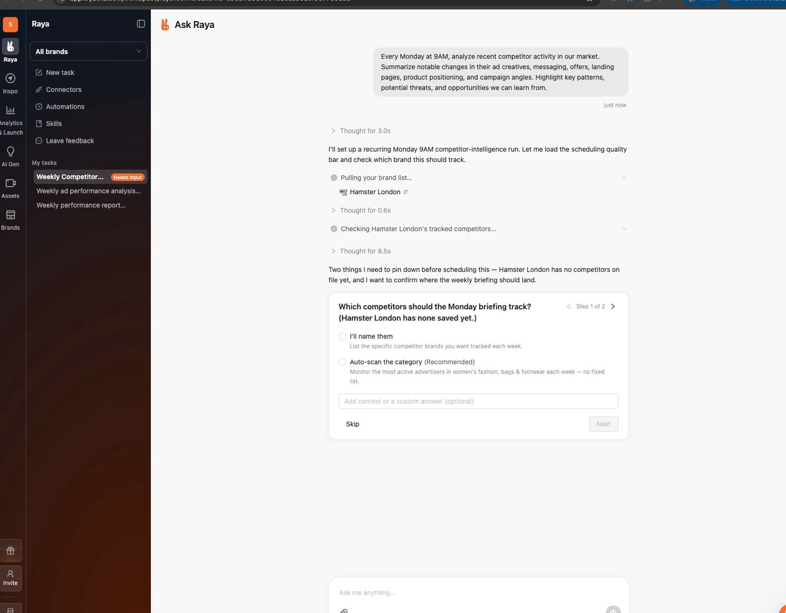
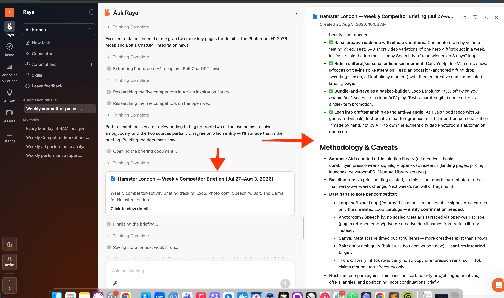
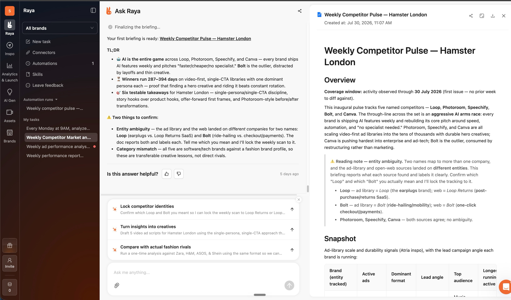
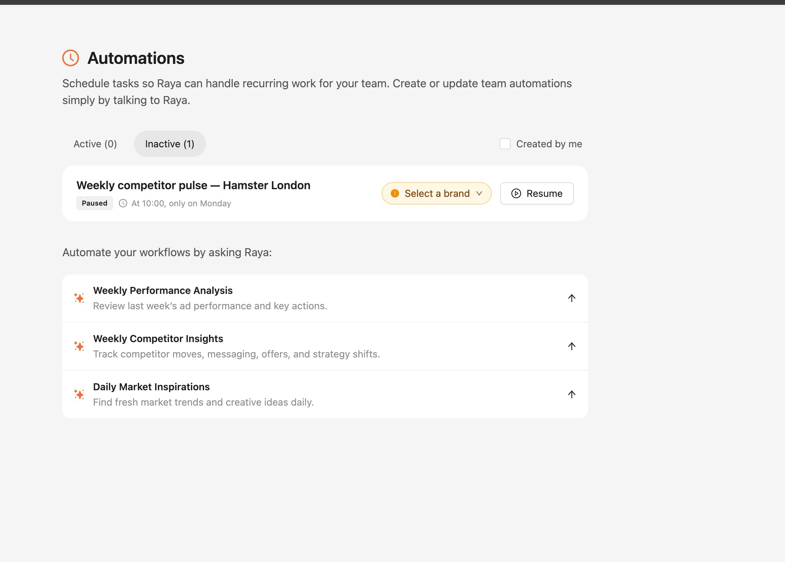
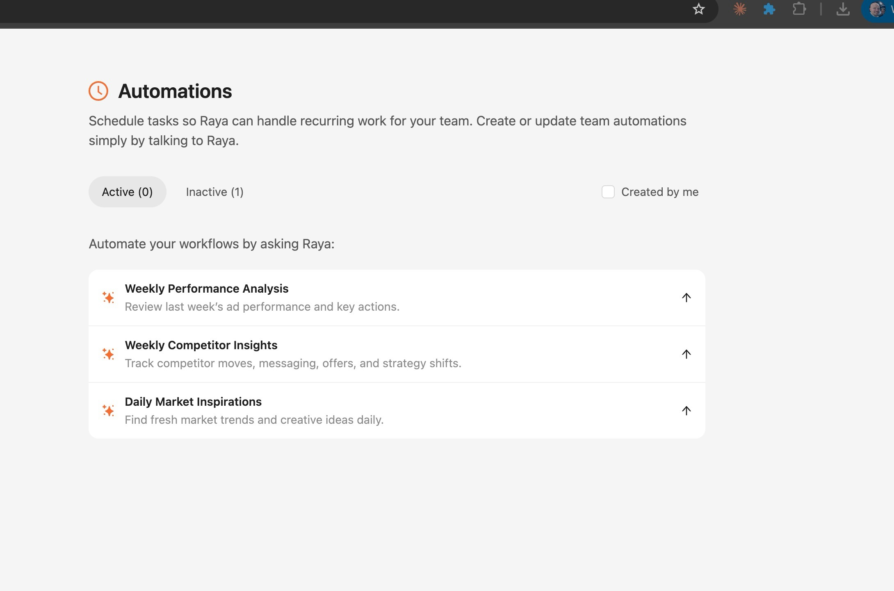
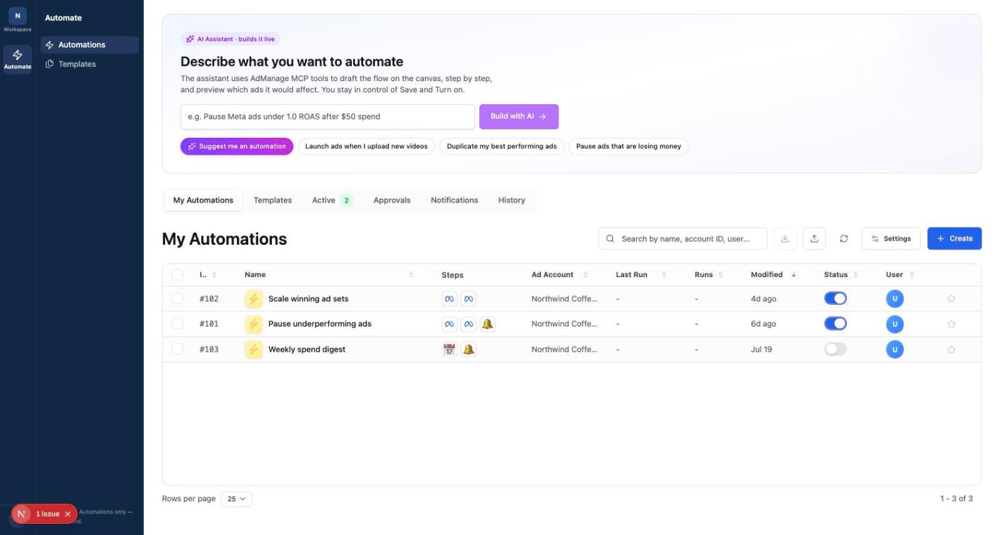
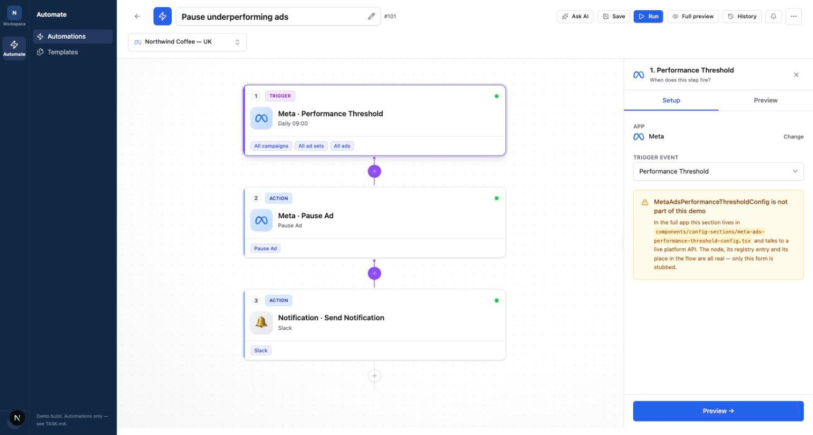
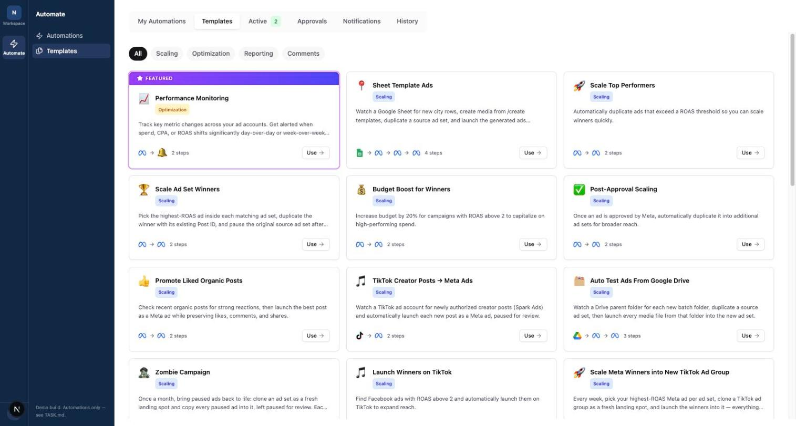

# Automation builder

A node-based rules builder for ad automations, extracted from a production app and
cut down to run on its own with mock data. No database, no auth, no API keys.

```bash
pnpm install
pnpm dev
```

Then open <http://localhost:3000>.

## The challenge

Rebuild this so **chat is the product**: describe recurring work in plain
language, an agent asks what it genuinely needs to know, does the work visibly,
and produces something worth reading.

Today the assistant is a 320px strip competing with the canvas for width. The
target is a chat-first agent with inline clarifying-question cards, expandable
reasoning and tool calls, and long output opening as a document in a split pane.

### The target

The agent asks what it genuinely needs before building anything, as an inline
card in the transcript — with reasoning and tool calls expandable above it:



Long output lands as a titled card in the transcript and opens as a document in a
split right-hand pane, so the chat keeps the TL;DR and the pane holds the piece:



The summary stays scannable — what it found, what it still needs confirmed — with
follow-up suggestions underneath:



An automation created in chat becomes a row you can manage, with its schedule in
plain words and blocking requirements surfaced inline (the amber pill means it
cannot run until answered):



Empty state offers starter automations rather than a blank page:



[`docs/reference/sample-output-document.md`](docs/reference/sample-output-document.md)
is a real generated briefing — that is the quality bar for what the agent writes.

**Full brief, every reference screenshot and the judging criteria: [TASK.md](TASK.md).**

## What it is

Pick a trigger, add filters and actions, save, run. The list, the canvas, the step
settings and the templates are the production components, not a reimplementation
built for the exercise.







## What is real and what is not

Worth reading before you debug something that was never wired up.

**Real** — production code, unmodified:

- The page shell and its six tabs (`app/(dashboard)/automation/page.tsx`)
- The canvas, node cards, connectors, add-step buttons, app selector
- `automation-context.tsx` — flow state, save, run, execution polling
- `automation-registry.ts` — the full catalogue of triggers and actions
- `node-summary.ts` — how a node becomes its summary line and chips
- The template gallery and its templates
- The assistant panel and its streaming client

**Mocked** — same interface, fake data behind it:

- `lib/providers/user-provider.tsx` — one fixed user, one workspace, two ad
  accounts. The app resolves this over SWR from `/api/user`.
- `app/api/automation-rules/route.ts` — CRUD against an in-memory array seeded
  with three automations (`lib/mock/automation-store.ts`). Saving, duplicating,
  toggling and deleting all work; state resets when the dev server restarts.
- `app/api/[...path]/route.ts` — a catch-all returning benign empty responses for
  the ~40 other endpoints the page calls, so the UI renders in its quiet state
  rather than filling with error toasts.
- `app/(dashboard)/reports/_features/*` — two hooks the criteria builder reads.

**Trimmed** — production shape, contents cut down:

- The sidebar. The original rail carries eight categories plus global search,
  invite, What's New and a workspace switcher, and its detail panel is resizable
  with a cookie-backed width. Here the rail shows the one category this repo ships
  (Automate) and the detail panel lists its pages. Markup, sizing and the
  `bg-sidebar` tokens are unchanged.
- The step registry. The original is ~4,000 lines covering every integration the
  product sells. This carries a representative spread across scheduling,
  performance, media and notification — same structure, readable in one sitting.
- The templates. The original ships dozens encoding specific paid strategies;
  this carries six generic shapes built only from steps in the registry.
- Billing. The original resolves entitlements from Stripe; this reads the
  organization's `plan` field, which is all the automation UI asks about.

**Stubbed** — present but inert:

- 44 of the 51 config sections. Each renders a labelled placeholder naming the
  real file. They are bound to live platform APIs (Meta ad accounts, TikTok
  identities, Google Sheets and Drive pickers, Frame.io, Notion), so they could
  not come across without faking a dozen integrations. The nodes, their registry
  entries and their place in the flow are all real — only the forms are stubbed.
  See `app/(dashboard)/automation/components/config-sections/not-ported-config.tsx`.
- Ad-set, campaign and TikTok / Pinterest / AppLovin pickers.
- AppLovin campaign creation and the comment-automation backend.

**Removed** — deliberately not in this repo:

- The staff email allowlist, an internal organization id, and internal storage
  hostnames.
- Live Stripe price ids and the pricing table.
- Real Google Sheet / Drive ids that were baked into the templates.
- Internal issue-tracker references in code comments.

## Layout

```
app/(dashboard)/layout.tsx   sidebar shell
app/(dashboard)/automation/  the page: components, contexts, hooks, lib
app/api/                     mock endpoints
components/sidebar/          icon rail and detail panel
components/ui/               shadcn primitives, copied from the app
lib/                         shared helpers, providers, billing and RBAC rules
lib/mock/                    the in-memory rules store
public/                      service icons
```

## Notes

- Seeded with three automations so the list, the builder and every status state
  are visible immediately. Open #101 for the simplest one.
- The mock user has two connected ad accounts, so the account selector in the
  builder header is populated rather than empty.
- The mock user is an **admin**, not an owner: the RBAC table grants
  `adaccounts.write` — the permission gating automations — to admin, editor,
  launcher and drafter only, so an owner would see every template padlocked.
- Light theme only.
- Service logos in `public/` are third-party trademarks, included because the
  integration UI references them.
- `components/ui/` is stock shadcn/ui (new-york), unmodified.
